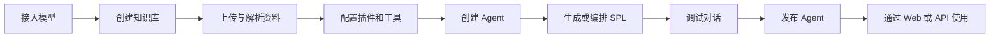
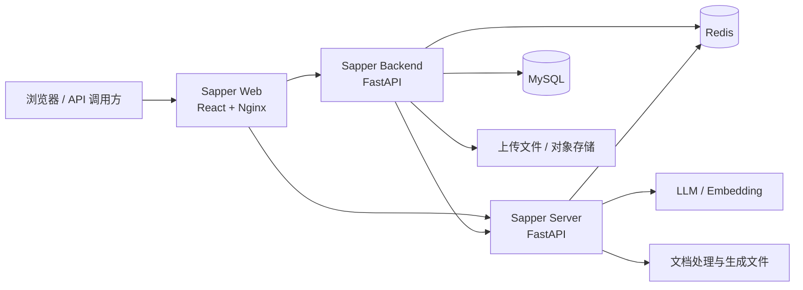

<div align="center">


# Sapper

简体中文 · [English](README.md)

### 面向知识库、工具调用与工作流编排的一站式 AI Agent 开发平台

**从模型接入、知识管理和插件配置，到 Agent 调试、发布与运行，都在同一个 Web 工作台中完成。**

[](https://react.dev/)
[](https://fastapi.tiangolo.com/)
[](https://www.typescriptlang.org/)
[](https://docs.docker.com/compose/)
[](LICENSE)

[🚀 在线体验](https://sapper.jxselab.com/) · [⚡ 快速开始](#-五分钟启动) · [🧭 核心能力](#-核心能力) · [🏗️ 系统架构](#️-系统架构) · [🛠️ 本地开发](#️-本地开发) · [🤝 参与贡献](#-参与贡献)

</div>

---

## 💡 Sapper 是什么

Sapper 是一个用于创建、管理、发布和运行 AI Agent 的开源平台。它将 Agent 配置、知识库、模型供应商、自定义插件、对话运行时与后台管理能力整合到统一的 Web 工作台中，适合搭建企业知识助手、垂直领域问答、流程型智能体和内部 AI 工具。

项目由三个可以独立开发和部署的服务组成：

- **Sapper Web**：负责 Agent、知识库、插件和系统配置的可视化操作；
- **Sapper Backend**：负责用户认证、权限、业务数据、文件、模型与发布管理；
- **Sapper Server**：负责 Sapper Chain、Sapper RAG、工具调用和 Agent 实际执行。

> 一句话理解 Sapper：把“模型 + 知识 + 工具 + 工作流”组织成可配置、可运行、可发布的 AI Agent。

## 🧭 核心能力

<table>
<tr>
<td width="33%" valign="top">

### 01 · 构建 Agent

- 创建与管理 Agent
- 配置提示词、模型和运行参数
- 生成并执行 SPL 工作流
- 管理对话、交互和运行状态

</td>
<td width="33%" valign="top">

### 02 · 连接知识

- 文本知识库与图知识库
- 文件解析、分块与索引
- 本地 Embedding 模型
- Sapper RAG 检索与问答

</td>
<td width="33%" valign="top">

### 03 · 扩展与发布

- 自定义插件和工具调用
- OpenAI 兼容模型供应商
- Agent 发布与运行接口
- OAuth2、对象存储等可选集成

</td>
</tr>
</table>

### 平台能力一览

| 能力领域 | 已提供的能力 |
| --- | --- |
| Agent 管理 | 创建、配置、调试、发布、对话与交互记录 |
| 工作流运行 | SPL 生成、Sapper Chain 执行、工具编排、回答生成 |
| 知识管理 | 知识库、文本集合、图集合、文本块、文件解析与检索 |
| 模型接入 | OpenAI 兼容接口、模型供应商与模型配置管理 |
| 插件系统 | 自定义插件管理、运行时工具接口和依赖加载 |
| 系统管理 | JWT 认证、用户、角色、菜单、部门、数据权限和操作日志 |
| 基础设施 | MySQL、Redis、Celery、对象存储及 Docker Compose |

## 🔄 从配置到运行的完整链路



Sapper 将管理面和运行面分开：Backend 负责“配置什么”，Server 负责“如何执行”。这样既方便 Web 端统一管理，也便于将运行时独立扩容或嵌入其他系统。

## 🏗️ 系统架构



| 层次 | 主要技术 | 职责 |
| --- | --- | --- |
| Web 工作台 | React 18、TypeScript、Vite、Ant Design、Redux、Tailwind CSS | 可视化配置、管理和使用 Agent |
| 管理服务 | FastAPI、SQLAlchemy Async、Pydantic、Socket.IO | 认证权限、Agent/知识/插件管理、文件与发布接口 |
| 运行时服务 | FastAPI、Sapper Chain、Sapper RAG | 工作流执行、检索增强、工具调用与模型交互 |
| 数据与缓存 | MySQL 8、Redis 7 | 业务数据、会话状态、限流和任务支撑 |
| AI 接入 | OpenAI 兼容 API、本地 Embedding | 语言模型推理与向量化 |
| 部署 | Docker Compose、Nginx | 多服务编排、反向代理和数据持久化 |

## ⚡ 五分钟启动

### Docker Compose（推荐）

环境要求：

- Docker Engine 24+
- Docker Compose v2
- 建议至少 8 GB 可用内存
- 首次构建需要访问 Docker、Python 和 Node 软件源
- 使用 AI 能力时需要可用的模型 API Key；使用向量检索时需要本地 Embedding 模型

```bash
git clone https://github.com/YuCheng1106/sapper.git
cd sapper
cp .env.docker.example .env
mkdir -p embed_model
```

编辑 `.env`，至少替换以下示例值：

```env
MYSQL_ROOT_PASSWORD=replace-with-a-strong-root-password
MYSQL_PASSWORD=replace-with-a-strong-database-password
TOKEN_SECRET_KEY=replace-with-a-random-token-secret
OPERA_LOG_ENCRYPT_SECRET_KEY=replace-with-a-64-character-hex-secret
```

生成随机密钥：

```bash
python -c "import secrets; print(secrets.token_urlsafe(32))"
python -c "import secrets; print(secrets.token_hex(32))"
```

如需使用 OpenAI 兼容模型，再配置：

```env
OPENAI_KEY=your-api-key
OPENAI_BASE_URL=https://api.openai.com/v1
OPENAI_MODEL=gpt-4o-mini
```

构建并启动全部服务：

```bash
docker compose up -d --build
docker compose ps
```

| 服务 | 默认地址 | 用途 |
| --- | --- | --- |
| Web 工作台 | <http://localhost:8008> | 登录、配置和使用 Agent |
| Backend OpenAPI | <http://localhost:8007/docs> | 管理端接口文档 |
| Server OpenAPI | <http://localhost:8006/docs> | 运行时接口文档 |
| Server 健康检查 | <http://localhost:8006/server/api/v1/health/proxy> | 运行时存活检查 |

首次启动后可直接进入注册页面创建账号。Web 容器会将同域的 `/api/` 请求代理到 Backend，将 `/server/` 请求代理到 Server。

> 运行时镜像包含 Torch、Transformers、Tesseract、wkhtmltopdf 等依赖，第一次构建可能需要较长时间。

### 查看日志与停止服务

```bash
# 查看所有服务日志
docker compose logs -f

# 只查看应用服务日志
docker compose logs -f sapper-backend sapper-server sapper-web

# 停止服务并保留数据
docker compose down
```

重新构建单个服务：

```bash
docker compose build sapper-backend
docker compose up -d sapper-backend
```

如需同时删除 MySQL、Redis、上传文件等 Compose 数据卷：

```bash
docker compose down -v
```

> ⚠️ `down -v` 会永久删除由 Compose 管理的数据，请先完成备份。

## ⚙️ 配置说明

### 配置文件索引

| 场景 | 模板文件 | 使用方式 |
| --- | --- | --- |
| Docker Compose | `.env.docker.example` | 复制为根目录 `.env` |
| Backend 本地开发 | `sapper_backend/.env.example` | 复制为 `sapper_backend/.env` |
| Server 本地开发 | `sapper_server/.env.template` | 复制为 `sapper_server/.env` |
| Web 本地开发 | `sapper_web/.env.example` | 复制为 `sapper_web/.env.development` |

### 常用环境变量

| 变量 | 是否必需 | 说明 |
| --- | :---: | --- |
| `MYSQL_ROOT_PASSWORD` | Docker 必需 | MySQL root 密码 |
| `MYSQL_PASSWORD` | Docker 必需 | Sapper 数据库用户密码 |
| `TOKEN_SECRET_KEY` | 是 | JWT 签名密钥 |
| `OPERA_LOG_ENCRYPT_SECRET_KEY` | 是 | 操作日志敏感字段加密密钥 |
| `OPENAI_KEY` | AI 功能需要 | OpenAI 兼容模型 API Key |
| `OPENAI_BASE_URL` | 否 | OpenAI 兼容接口地址 |
| `OPENAI_MODEL` | 否 | 默认模型名称 |
| `EMBEDDING_MODEL_HOST_PATH` | RAG 功能需要 | 宿主机 Embedding 模型路径 |
| `PUBLIC_FILE_URL` | 否 | Server 生成文件的公开访问前缀 |
| `BIND_HOST` | 否 | Compose 端口绑定地址，默认 `127.0.0.1` |

模板中还包含 GitHub/LinuxDo OAuth2、对象存储、讯飞语音识别和外部机器人服务等可选配置；不使用时可以留空。

### 本地 Embedding 模型

Compose 默认将根目录 `embed_model/` 只读挂载到容器内的 `/models/embedding`：

```bash
mkdir -p embed_model
```

也可以在 `.env` 中指向其他目录：

```env
EMBEDDING_MODEL_HOST_PATH=/absolute/path/to/your/embedding/model
```

目录为空时不影响基础管理功能，但依赖向量化的接口会因为缺少模型而无法工作。

### 网络暴露

Compose 默认只监听 `127.0.0.1`。需要在局域网或公网访问时，可设置：

```env
BIND_HOST=0.0.0.0
```

公网部署时请同时配置防火墙、HTTPS 和反向代理，并避免直接暴露 MySQL、Redis、Swagger 和调试接口。

## 🛠️ 本地开发

### 环境要求

- Python 3.10+
- Node.js 20+
- pnpm
- MySQL 8.x
- Redis 7.x
- 可选：RabbitMQ/Celery、wkhtmltopdf、Tesseract 和本地 Embedding 模型

### 1. 启动 Backend

```bash
cd sapper_backend
cp .env.example .env
python -m venv .venv
source .venv/bin/activate
python -m pip install -r requirements.txt
uvicorn main:app --host 0.0.0.0 --port 8007 --reload
```

Backend 启动时会自动创建当前模型对应的数据表。

### 2. 启动 Server

另开一个终端：

```bash
cd sapper_server
cp .env.template .env
python -m venv .venv
source .venv/bin/activate
python -m pip install -r requirements.txt
uvicorn main:app --host 0.0.0.0 --port 8006 --reload
```

### 3. 启动 Web

再开一个终端：

```bash
cd sapper_web
cp .env.example .env.development
corepack enable
pnpm install
pnpm dev --host 0.0.0.0 --port 8008
```

### 常用验证命令

```bash
# Web
cd sapper_web
pnpm type-check
pnpm lint
pnpm build

# Backend
cd sapper_backend
pytest

# Server
cd sapper_server
pytest

# Compose 配置检查
docker compose --env-file .env.docker.example config --quiet
```

## 🔌 API 概览

| 服务 | API 前缀 | 主要模块 |
| --- | --- | --- |
| Backend | `/api/v1` | 认证、用户与权限、任务、系统管理 |
| Sapper Backend 插件 | `/api/v1/sapper` | Agent、对话、知识库、文件、插件与发布 |
| 模型管理 | `/api/v1/llm` | 模型供应商和模型配置 |
| Runtime | `/server/api/v1` | 健康检查、Sapper Chain、Sapper RAG、自定义插件 |

FastAPI 在开发配置下提供 Swagger/OpenAPI 页面，可直接查看当前版本实际注册的全部接口。

## 🗂️ 项目结构

```text
.
├── sapper_web/                 # React + TypeScript Web 工作台
│   ├── src/                    # 页面、组件、API、状态与业务代码
│   ├── public/                 # 公共静态资源
│   ├── Dockerfile              # Web 构建及 Nginx 运行镜像
│   └── nginx.conf              # API 反向代理配置
├── sapper_backend/             # 管理服务
│   ├── app/admin/              # 认证、用户、权限和系统管理
│   ├── app/task/               # 异步任务模块
│   ├── plugin/                 # Agent、知识、模型、文件和发布插件
│   ├── database/               # MySQL 与 Redis 数据访问
│   └── alembic/                # 数据库迁移基础结构
├── sapper_server/              # Agent 运行时服务
│   ├── app/api/v1/             # Runtime API
│   ├── sapperchain/            # SPL 工作流与工具执行
│   └── sapperrag/              # 文档、索引、检索与 GraphRAG
├── scripts/                    # 非容器启动和停止脚本
├── compose.yaml                # 本地完整服务编排
├── .env.docker.example         # Compose 环境变量模板
├── THIRD_PARTY_NOTICES.md      # 第三方组件与许可证声明
└── LICENSE                     # Apache License 2.0
```

## 💾 数据持久化

Compose 默认创建以下命名卷：

| 数据卷 | 保存内容 |
| --- | --- |
| `mysql_data` | MySQL 业务数据 |
| `redis_data` | Redis 持久化数据 |
| `backend_uploads` | Backend 上传文件 |
| `backend_logs` | Backend 文件日志 |
| `server_files` | Server 生成文件 |
| `server_logs` | Server 文件日志 |

本地 Embedding 模型采用只读绑定挂载，不保存在命名卷中。升级或迁移前应备份数据库、上传文件、生成文件以及本地 `.env`。

## ❓ 常见问题

<details>
<summary><strong>为什么第一次构建很慢？</strong></summary>

Server 包含 Torch、Transformers、文档解析、OCR 和格式转换依赖，镜像体积较大。首次构建需要下载系统包、Python 包和基础镜像，后续构建会利用 Docker 缓存。

</details>

<details>
<summary><strong>Web 可以打开，但 Agent 无法调用模型？</strong></summary>

检查 `.env` 中的 `OPENAI_KEY`、`OPENAI_BASE_URL` 和 `OPENAI_MODEL`，再通过 `docker compose logs -f sapper-server` 查看运行时日志。使用第三方兼容接口时，还要确认模型名称和接口路径与供应商要求一致。

</details>

<details>
<summary><strong>知识库导入成功，但向量检索失败？</strong></summary>

确认 `EMBEDDING_MODEL_HOST_PATH` 指向有效模型目录，并且容器内 `/models/embedding` 可读取。可以使用 `docker compose exec sapper-server ls -la /models/embedding` 检查挂载结果。

</details>

<details>
<summary><strong>如何让其他机器访问？</strong></summary>

将 `.env` 中的 `BIND_HOST` 改为 `0.0.0.0`，再重建或重启服务。生产环境应通过 Nginx、Caddy 或 Ingress 提供域名和 HTTPS，并限制数据库与管理接口的访问范围。

</details>

<details>
<summary><strong>如何彻底重置本地 Docker 数据？</strong></summary>

执行 `docker compose down -v`，然后重新启动。该命令会删除 Compose 命名卷中的数据库、缓存、日志和文件，且不可恢复。

</details>

## 📌 项目状态

Sapper 正在从内部部署项目逐步整理为通用开源项目。目前核心的 Agent、知识库、插件、管理后台和运行时能力已经纳入仓库，部署配置、文档、测试覆盖和代码规范仍会持续完善。

建议先在开发或测试环境中评估，再根据自己的模型供应商、存储方式、安全策略和业务规模完成生产化加固。

## 🔒 安全建议

- 不要提交 `.env`、日志、上传文件、数据库、私钥、Token 或真实业务数据；
- 公开旧项目的代码前，轮换所有曾经在历史版本中出现过的凭据；
- 生产环境必须替换所有示例密码和密钥，并启用 HTTPS、备份、资源限制和监控；
- 不要在日志中记录 Authorization、Cookie、模型完整输入输出、文档正文或用户隐私信息；
- 远程文件解析和插件调用可能访问外部 URL，生产环境应增加 SSRF 防护、域名白名单、大小限制与超时；
- 对公网开放前，请自行审查 CORS、OAuth 回调、对象存储公开地址和接口权限。

## 🤝 参与贡献

欢迎通过 Issue 和 Pull Request 参与 Sapper。提交前建议：

1. Fork 仓库并从 `main` 创建功能分支；
2. 保持改动聚焦，不提交本地配置、生成文件和无关格式化；
3. 为行为变化补充测试或清晰的复现步骤；
4. 运行受影响服务的类型检查、构建或测试；
5. 在 Pull Request 中说明背景、改动内容、验证方式和兼容性影响。

Bug 报告请尽量附带系统环境、启动方式、最小复现步骤和脱敏日志。功能建议请描述具体使用场景以及希望解决的问题。

## 📚 研究背景与引用

Sapper 的 AI Chain 构建理念源自 **Prompt Sapper** 相关研究。论文介绍了一个由大语言模型赋能的 AI Chain 生产工具，通过可视化和低代码方式帮助开发者设计、构建与维护 AI Chain。

- **论文**：[Prompt Sapper: A LLM-Empowered Production Tool for Building AI Chains](https://doi.org/10.1145/3638247)
- **论文代码仓库**：[YuCheng1106/PromptSapper](https://github.com/YuCheng1106/PromptSapper)
- **期刊**：ACM Transactions on Software Engineering and Methodology（TOSEM），2024

如果本项目或相关研究对你的工作有所帮助，欢迎引用：

```bibtex
@article{10.1145/3638247,
  author = {Cheng, Yu and Chen, Jieshan and Huang, Qing and Xing, Zhenchang and Xu, Xiwei and Lu, Qinghua},
  title = {Prompt Sapper: A LLM-Empowered Production Tool for Building AI Chains},
  year = {2024},
  issue_date = {June 2024},
  publisher = {Association for Computing Machinery},
  address = {New York, NY, USA},
  volume = {33},
  number = {5},
  issn = {1049-331X},
  url = {https://doi.org/10.1145/3638247},
  doi = {10.1145/3638247},
  journal = {ACM Trans. Softw. Eng. Methodol.},
  month = {jun},
  articleno = {124},
  numpages = {24},
  keywords = {AI chain engineering, visual programming, large language models, No/Low code, SE for AI}
}
```

## 📄 许可证

Sapper 原创代码采用 [Apache License 2.0](LICENSE) 开源。你可以在遵守许可证条款的前提下使用、修改和分发项目。

仓库中的第三方组件继续遵循各自的许可证。特别是两份内嵌的 MinerU 源码采用 AGPL-3.0，根目录的 Apache-2.0 **不会**覆盖这些第三方代码的许可证义务。分发或部署完整仓库前，请务必阅读 [THIRD_PARTY_NOTICES.md](THIRD_PARTY_NOTICES.md)。

<div align="center">

如果 Sapper 对你的 Agent 开发工作有帮助，欢迎 Star、试用并分享反馈。

</div>


## 🙏 致谢

- **项目贡献者们：**

<p>
  <a href="https://github.com/SE-qinghuang"></a>
  <a href="https://github.com/CodingFeng101"></a>
  <a href="https://github.com/lixian292"></a>
  <a href="https://github.com/LiKunKun64867"></a>
</p>