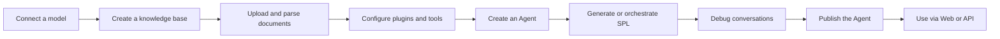
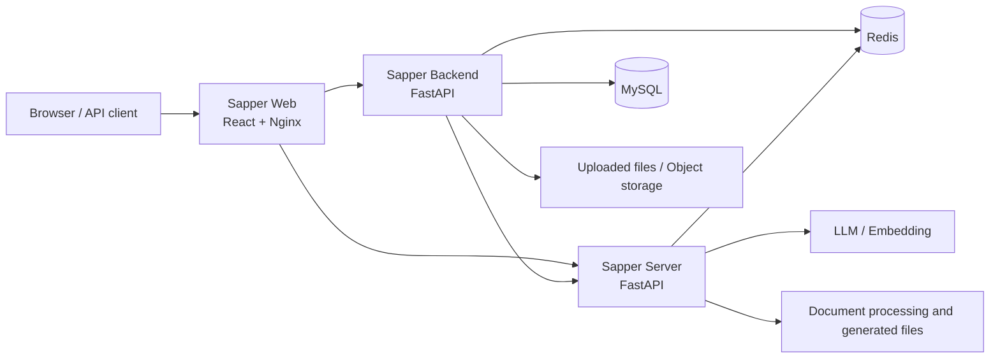

<div align="center">


# Sapper

English · [简体中文](README.cn.md)

### An all-in-one AI Agent development platform for knowledge bases, tool calling, and workflow orchestration

**Connect models, manage knowledge, configure plugins, debug Agents, publish, and run—all from one web workspace.**

[](https://react.dev/)
[](https://fastapi.tiangolo.com/)
[](https://www.typescriptlang.org/)
[](https://docs.docker.com/compose/)
[](LICENSE)

[🚀 Online Demo](https://sapper.jxselab.com/) · [⚡ Quick Start](#-five-minute-quick-start) · [🧭 Core Capabilities](#-core-capabilities) · [🏗️ Architecture](#️-system-architecture) · [🛠️ Local Development](#️-local-development) · [🤝 Contributing](#-contributing)

</div>

---

## 💡 What is Sapper?

Sapper is an open-source platform for creating, managing, publishing, and running AI Agents. It brings Agent configuration, knowledge bases, model providers, custom plugins, conversational runtimes, and administration into a unified web workspace. Sapper is suitable for building enterprise knowledge assistants, domain-specific Q&A systems, process-oriented Agents, and internal AI tools.

The project consists of three services that can be developed and deployed independently:

- **Sapper Web** provides visual management for Agents, knowledge bases, plugins, and system configuration.
- **Sapper Backend** handles authentication, permissions, business data, files, models, and publishing.
- **Sapper Server** executes Sapper Chain, Sapper RAG, tool calls, and Agents at runtime.

> In one sentence: Sapper organizes “models + knowledge + tools + workflows” into configurable, runnable, and publishable AI Agents.

## 🧭 Core Capabilities

<table>
<tr>
<td width="33%" valign="top">

### 01 · Build Agents

- Create and manage Agents
- Configure prompts, models, and runtime parameters
- Generate and execute SPL workflows
- Manage conversations, interactions, and runtime status

</td>
<td width="33%" valign="top">

### 02 · Connect Knowledge

- Text and graph knowledge bases
- File parsing, chunking, and indexing
- Local embedding models
- Retrieval and Q&A with Sapper RAG

</td>
<td width="33%" valign="top">

### 03 · Extend and Publish

- Custom plugins and tool calling
- OpenAI-compatible model providers
- Agent publishing and runtime APIs
- Optional OAuth2, object storage, and other integrations

</td>
</tr>
</table>

### Platform Capabilities at a Glance

| Area | Available capabilities |
| --- | --- |
| Agent management | Creation, configuration, debugging, publishing, conversations, and interaction history |
| Workflow runtime | SPL generation, Sapper Chain execution, tool orchestration, and answer generation |
| Knowledge management | Knowledge bases, text collections, graph collections, text blocks, file parsing, and retrieval |
| Model integration | OpenAI-compatible APIs, model providers, and model configuration management |
| Plugin system | Custom plugin management, runtime tool APIs, and dependency loading |
| System administration | JWT authentication, users, roles, menus, departments, data permissions, and operation logs |
| Infrastructure | MySQL, Redis, Celery, object storage, and Docker Compose |

## 🔄 The Complete Configuration-to-Runtime Flow



Sapper separates its management plane from its runtime plane: Backend determines *what is configured*, while Server determines *how it is executed*. This separation supports unified web management while allowing the runtime to be scaled independently or embedded into other systems.

## 🏗️ System Architecture



| Layer | Main technologies | Responsibilities |
| --- | --- | --- |
| Web workspace | React 18, TypeScript, Vite, Ant Design, Redux, Tailwind CSS | Visual configuration, management, and use of Agents |
| Management service | FastAPI, SQLAlchemy Async, Pydantic, Socket.IO | Authentication and authorization, Agent/knowledge/plugin management, files, and publishing APIs |
| Runtime service | FastAPI, Sapper Chain, Sapper RAG | Workflow execution, retrieval augmentation, tool calling, and model interaction |
| Data and cache | MySQL 8, Redis 7 | Business data, session state, rate limiting, and task support |
| AI integration | OpenAI-compatible APIs, local embeddings | Language model inference and vectorization |
| Deployment | Docker Compose, Nginx | Multi-service orchestration, reverse proxying, and data persistence |

## ⚡ Five-Minute Quick Start

### Docker Compose (Recommended)

Requirements:

- Docker Engine 24+
- Docker Compose v2
- At least 8 GB of available memory is recommended
- The first build requires access to Docker, Python, and Node package registries
- AI features require a valid model API key; vector retrieval requires a local embedding model

```bash
git clone https://github.com/YuCheng1106/sapper.git
cd sapper
cp .env.docker.example .env
mkdir -p embed_model
```

Edit `.env` and replace at least the following example values:

```env
MYSQL_ROOT_PASSWORD=replace-with-a-strong-root-password
MYSQL_PASSWORD=replace-with-a-strong-database-password
TOKEN_SECRET_KEY=replace-with-a-random-token-secret
OPERA_LOG_ENCRYPT_SECRET_KEY=replace-with-a-64-character-hex-secret
```

Generate random secrets:

```bash
python -c "import secrets; print(secrets.token_urlsafe(32))"
python -c "import secrets; print(secrets.token_hex(32))"
```

To use an OpenAI-compatible model, also configure:

```env
OPENAI_KEY=your-api-key
OPENAI_BASE_URL=https://api.openai.com/v1
OPENAI_MODEL=gpt-4o-mini
```

Build and start all services:

```bash
docker compose up -d --build
docker compose ps
```

| Service | Default URL | Purpose |
| --- | --- | --- |
| Web workspace | <http://localhost:8008> | Sign in, configure, and use Agents |
| Backend OpenAPI | <http://localhost:8007/docs> | Management API documentation |
| Server OpenAPI | <http://localhost:8006/docs> | Runtime API documentation |
| Server health check | <http://localhost:8006/server/api/v1/health/proxy> | Runtime liveness check |

After the first startup, open the registration page to create an account. The Web container proxies same-origin `/api/` requests to Backend and `/server/` requests to Server.

> The runtime image includes Torch, Transformers, Tesseract, wkhtmltopdf, and other dependencies, so the first build may take some time.

### View Logs and Stop Services

```bash
# View logs from all services
docker compose logs -f

# View only application service logs
docker compose logs -f sapper-backend sapper-server sapper-web

# Stop services while preserving data
docker compose down
```

Rebuild a single service:

```bash
docker compose build sapper-backend
docker compose up -d sapper-backend
```

To also remove the MySQL, Redis, upload, and other Compose volumes:

```bash
docker compose down -v
```

> ⚠️ `down -v` permanently deletes data managed by Compose. Back it up first.

## ⚙️ Configuration

### Configuration File Index

| Scenario | Template | Usage |
| --- | --- | --- |
| Docker Compose | `.env.docker.example` | Copy to `.env` in the repository root |
| Backend local development | `sapper_backend/.env.example` | Copy to `sapper_backend/.env` |
| Server local development | `sapper_server/.env.template` | Copy to `sapper_server/.env` |
| Web local development | `sapper_web/.env.example` | Copy to `sapper_web/.env.development` |

### Common Environment Variables

| Variable | Required | Description |
| --- | :---: | --- |
| `MYSQL_ROOT_PASSWORD` | Docker | MySQL root password |
| `MYSQL_PASSWORD` | Docker | Password for the Sapper database user |
| `TOKEN_SECRET_KEY` | Yes | JWT signing secret |
| `OPERA_LOG_ENCRYPT_SECRET_KEY` | Yes | Secret used to encrypt sensitive operation-log fields |
| `OPENAI_KEY` | For AI features | OpenAI-compatible model API key |
| `OPENAI_BASE_URL` | No | OpenAI-compatible API base URL |
| `OPENAI_MODEL` | No | Default model name |
| `EMBEDDING_MODEL_HOST_PATH` | For RAG features | Path to the embedding model on the host |
| `PUBLIC_FILE_URL` | No | Public URL prefix for files generated by Server |
| `BIND_HOST` | No | Compose port binding address; defaults to `127.0.0.1` |

The templates also include optional settings for GitHub/LinuxDo OAuth2, object storage, iFlytek speech recognition, and external robot services. Leave them empty when not in use.

### Local Embedding Model

By default, Compose mounts `embed_model/` from the repository root into `/models/embedding` in the container as read-only:

```bash
mkdir -p embed_model
```

You can point to another directory in `.env`:

```env
EMBEDDING_MODEL_HOST_PATH=/absolute/path/to/your/embedding/model
```

An empty directory does not affect basic management features, but APIs that require vectorization will not work without a model.

### Network Exposure

Compose binds only to `127.0.0.1` by default. To allow access from a LAN or public network, set:

```env
BIND_HOST=0.0.0.0
```

For public deployments, also configure a firewall, HTTPS, and a reverse proxy. Do not expose MySQL, Redis, Swagger, or debugging endpoints directly to the internet.

## 🛠️ Local Development

### Requirements

- Python 3.10+
- Node.js 20+
- pnpm
- MySQL 8.x
- Redis 7.x
- Optional: RabbitMQ/Celery, wkhtmltopdf, Tesseract, and a local embedding model

### 1. Start Backend

```bash
cd sapper_backend
cp .env.example .env
python -m venv .venv
source .venv/bin/activate
python -m pip install -r requirements.txt
uvicorn main:app --host 0.0.0.0 --port 8007 --reload
```

Backend automatically creates the database tables represented by the current models at startup.

### 2. Start Server

Open another terminal:

```bash
cd sapper_server
cp .env.template .env
python -m venv .venv
source .venv/bin/activate
python -m pip install -r requirements.txt
uvicorn main:app --host 0.0.0.0 --port 8006 --reload
```

### 3. Start Web

Open a third terminal:

```bash
cd sapper_web
cp .env.example .env.development
corepack enable
pnpm install
pnpm dev --host 0.0.0.0 --port 8008
```

### Common Verification Commands

```bash
# Web
cd sapper_web
pnpm type-check
pnpm lint
pnpm build

# Backend
cd sapper_backend
pytest

# Server
cd sapper_server
pytest

# Validate the Compose configuration
docker compose --env-file .env.docker.example config --quiet
```

## 🔌 API Overview

| Service | API prefix | Main modules |
| --- | --- | --- |
| Backend | `/api/v1` | Authentication, users and permissions, tasks, and system administration |
| Sapper Backend plugins | `/api/v1/sapper` | Agents, conversations, knowledge bases, files, plugins, and publishing |
| Model management | `/api/v1/llm` | Model providers and model configuration |
| Runtime | `/server/api/v1` | Health checks, Sapper Chain, Sapper RAG, and custom plugins |

With development settings enabled, FastAPI provides Swagger/OpenAPI pages where you can inspect every route registered by the current version.

## 🗂️ Project Structure

```text
.
├── sapper_web/                 # React + TypeScript web workspace
│   ├── src/                    # Pages, components, APIs, state, and business logic
│   ├── public/                 # Public static assets
│   ├── Dockerfile              # Web build and Nginx runtime image
│   └── nginx.conf              # API reverse proxy configuration
├── sapper_backend/             # Management service
│   ├── app/admin/              # Authentication, users, permissions, and system administration
│   ├── app/task/               # Asynchronous task module
│   ├── plugin/                 # Agent, knowledge, model, file, and publishing plugins
│   ├── database/               # MySQL and Redis data access
│   └── alembic/                # Database migration infrastructure
├── sapper_server/              # Agent runtime service
│   ├── app/api/v1/             # Runtime APIs
│   ├── sapperchain/            # SPL workflows and tool execution
│   └── sapperrag/              # Documents, indexing, retrieval, and GraphRAG
├── scripts/                    # Non-container start and stop scripts
├── compose.yaml                # Complete local service orchestration
├── .env.docker.example         # Compose environment variable template
├── THIRD_PARTY_NOTICES.md      # Third-party components and license notices
└── LICENSE                     # Apache License 2.0
```

## 💾 Data Persistence

Compose creates the following named volumes by default:

| Volume | Contents |
| --- | --- |
| `mysql_data` | MySQL business data |
| `redis_data` | Persistent Redis data |
| `backend_uploads` | Files uploaded through Backend |
| `backend_logs` | Backend file logs |
| `server_files` | Files generated by Server |
| `server_logs` | Server file logs |

The local embedding model is mounted through a read-only bind mount rather than stored in a named volume. Before an upgrade or migration, back up the database, uploaded files, generated files, and your local `.env`.

## ❓ FAQ

<details>
<summary><strong>Why is the first build slow?</strong></summary>

Server includes Torch, Transformers, document parsing, OCR, and format-conversion dependencies, which results in a large image. The first build downloads system packages, Python packages, and base images; later builds can reuse the Docker cache.

</details>

<details>
<summary><strong>The Web UI opens, but the Agent cannot call a model. What should I check?</strong></summary>

Check `OPENAI_KEY`, `OPENAI_BASE_URL`, and `OPENAI_MODEL` in `.env`, then inspect the runtime logs with `docker compose logs -f sapper-server`. When using a third-party compatible endpoint, confirm that the model name and API path match the provider's requirements.

</details>

<details>
<summary><strong>A knowledge-base import succeeds, but vector retrieval fails. Why?</strong></summary>

Confirm that `EMBEDDING_MODEL_HOST_PATH` points to a valid model directory and that `/models/embedding` is readable inside the container. Run `docker compose exec sapper-server ls -la /models/embedding` to inspect the mounted files.

</details>

<details>
<summary><strong>How can other machines access Sapper?</strong></summary>

Set `BIND_HOST=0.0.0.0` in `.env`, then rebuild or restart the services. In production, use Nginx, Caddy, or an Ingress to provide a domain and HTTPS, and restrict access to database and management endpoints.

</details>

<details>
<summary><strong>How do I completely reset local Docker data?</strong></summary>

Run `docker compose down -v`, then start the stack again. This command deletes the database, cache, logs, and files stored in Compose named volumes and cannot be undone.

</details>

## 📌 Project Status

Sapper is being progressively prepared for general open-source use after originally serving as an internally deployed project. The core Agent, knowledge-base, plugin, administration, and runtime capabilities are now included in the repository. Deployment configuration, documentation, test coverage, and code quality conventions will continue to improve.

We recommend evaluating Sapper in a development or test environment first, then applying production hardening appropriate to your model provider, storage architecture, security policies, and workload scale.

## 🔒 Security Recommendations

- Do not commit `.env` files, logs, uploads, databases, private keys, tokens, or real business data.
- Before publishing code from an older project, rotate every credential that may have appeared in its history.
- Replace all example passwords and secrets in production, and enable HTTPS, backups, resource limits, and monitoring.
- Do not record Authorization headers, cookies, complete model inputs or outputs, document bodies, or personal data in logs.
- Remote file parsing and plugin calls may access external URLs. Add SSRF protection, domain allowlists, size limits, and timeouts in production.
- Before exposing Sapper publicly, review CORS, OAuth callbacks, public object-storage URLs, and API permissions for your environment.

## 🤝 Contributing

Contributions through issues and pull requests are welcome. Before submitting a change:

1. Fork the repository and create a feature branch from `main`.
2. Keep the change focused; do not include local configuration, generated files, or unrelated formatting.
3. Add tests or clear reproduction steps for behavioral changes.
4. Run the relevant type checks, builds, or tests for the affected services.
5. Describe the context, changes, verification steps, and compatibility impact in the pull request.

For bug reports, include your environment, startup method, minimal reproduction steps, and sanitized logs when possible. For feature requests, describe the use case and the specific problem you want to solve.

## 📚 Research and Citation

Sapper's approach to AI Chain construction builds on the **Prompt Sapper** research project. The paper presents an LLM-empowered production tool that helps developers design, build, and maintain AI Chains through visual and low-code workflows.

- **Paper**: [Prompt Sapper: A LLM-Empowered Production Tool for Building AI Chains](https://doi.org/10.1145/3638247)
- **Research repository**: [YuCheng1106/PromptSapper](https://github.com/YuCheng1106/PromptSapper)
- **Published in**: ACM Transactions on Software Engineering and Methodology (TOSEM), 2024

If this project or the related research supports your work, please cite:

```bibtex
@article{10.1145/3638247,
  author = {Cheng, Yu and Chen, Jieshan and Huang, Qing and Xing, Zhenchang and Xu, Xiwei and Lu, Qinghua},
  title = {Prompt Sapper: A LLM-Empowered Production Tool for Building AI Chains},
  year = {2024},
  issue_date = {June 2024},
  publisher = {Association for Computing Machinery},
  address = {New York, NY, USA},
  volume = {33},
  number = {5},
  issn = {1049-331X},
  url = {https://doi.org/10.1145/3638247},
  doi = {10.1145/3638247},
  journal = {ACM Trans. Softw. Eng. Methodol.},
  month = {jun},
  articleno = {124},
  numpages = {24},
  keywords = {AI chain engineering, visual programming, large language models, No/Low code, SE for AI}
}
```

## 📄 License

Sapper's original code is released under the [Apache License 2.0](LICENSE). You may use, modify, and distribute the project in compliance with the license terms.

Third-party components in this repository remain subject to their own licenses. In particular, the two bundled MinerU source trees are licensed under AGPL-3.0. The root Apache-2.0 license **does not** override the licensing obligations for this third-party code. Before distributing or deploying the complete repository, read [THIRD_PARTY_NOTICES.md](THIRD_PARTY_NOTICES.md).

<div align="center">

If Sapper helps with your Agent development work, consider giving it a Star, trying it out, and sharing your feedback.

</div>


## 🙏 Acknowledgements

- **Project contributors:**

<p>
  <a href="https://github.com/SE-qinghuang"></a>
  <a href="https://github.com/CodingFeng101"></a>
  <a href="https://github.com/lixian292"></a>
  <a href="https://github.com/LiKunKun64867"></a>
</p>
